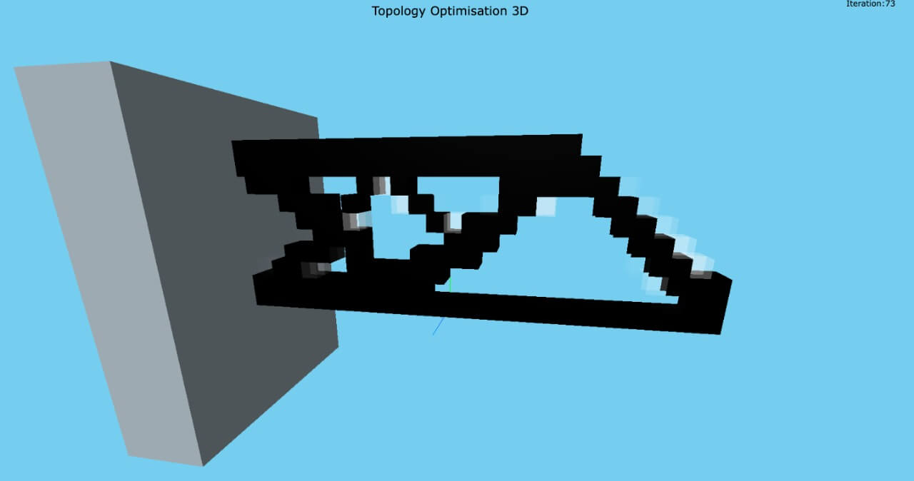

# [TopOptWeb3D](https://vivektramamoorthy.github.io/TopOptWeb3D)

This is a web app for 3D topology optimisation. Access the app by clicking on the title or going to the URL [https://vivektramamoorthy.github.io/TopOptWeb3D](https://vivektramamoorthy.github.io/TopOptWeb3D).

## Dependencies 
[THREEJS](https://threejs.org)

[Mat4js](https://github.com/KovacsGG/mat4js)

[MatlabJS](https://VivekTRamamoorthy.github.io/MatlabJS)

## References
- Bendsøe, Martin Philip, and Noboru Kikuchi. "Generating optimal topologies in structural design using a homogenization method." Computer methods in applied mechanics and engineering 71, no. 2 (1988): 197-224.
- Sigmund, Ole, and Kurt Maute. "Topology optimization approaches." Structural and Multidisciplinary Optimization 48, no. 6 (2013): 1031-1055.
- Liu, Kai, and Andrés Tovar. "An efficient 3D topology optimization code written in Matlab." Structural and Multidisciplinary Optimization 50, no. 6 (2014): 1175-1196.

## License
MIT License Copyright &copy; Vivek T Ramamoorthy 2022
